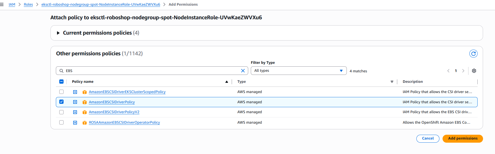

# k8-volumes
k8-volumes


# Ephemeral Volume
1. Empty Dir
2. Host Path

# Empty Dir
- Create volume at POD level
- emptyDir volume is initially empty when POD is created
- All containers in the pod can read and write the same files in the emptyDir volume, though that volume can be mounted at the same or different paths in each container
- Mount volume to the container inside pods, Volume will be created when POD creates, Volume will be deleted when POD deletes
- Volume is shared between all the containers inside the POD, Volume is stored in the node where POD is running
- Volume is not persistent, data will be lost when POD is deleted
- Use case: Temporary data, cache, scratch space, etc.
```shell
$ kubectl apply -f empty-dir-volume.yaml

Open k9s tool and go to pods.
By selecting the pod `test-empty-dir-volume` and then select the container `almalinux` and then select the shell, you can see the below output.

<<K9s-Shell>> Pod: roboshop/test-empty-dir-volume | Container: almalinux
[root@test-empty-dir-volume /]# cd /mnt/nginx-cache/
[root@test-empty-dir-volume nginx-cache]# ls -la
total 4
drwxrwxrwx. 2 root root  41 Apr 24 10:23 .
drwxr-xr-x. 1 root root  25 Apr 24 10:23 ..
-rw-r--r--. 1 root root   0 Apr 24 10:23 access.log
-rw-r--r--. 1 root root 509 Apr 24 10:23 error.log
[root@test-empty-dir-volume nginx-cache]# cat error.log
2026/04/24 10:23:17 [notice] 1#1: using the "epoll" event method
2026/04/24 10:23:17 [notice] 1#1: nginx/1.29.8
2026/04/24 10:23:17 [notice] 1#1: built by gcc 14.2.0 (Debian 14.2.0-19)
2026/04/24 10:23:17 [notice] 1#1: OS: Linux 6.12.79-101.147.amzn2023.x86_64
2026/04/24 10:23:17 [notice] 1#1: getrlimit(RLIMIT_NOFILE): 65536:1048576
2026/04/24 10:23:17 [notice] 1#1: start worker processes
2026/04/24 10:23:17 [notice] 1#1: start worker process 30
2026/04/24 10:23:17 [notice] 1#1: start worker process 31
[root@test-empty-dir-volume nginx-cache]#

```
- Empty dir will in case of side-car containers to read from one container and write to another container.


## Host Path
- A container can access the file system of the node where it is running using hostPath volume.
- Host path volume mounts a file or directory from the host node's filesystem into a pod. 
- This is not that secure to give access to the host file system to the container, so use it with caution.
- But some case, if we want to see the nodes logs we allow pods and container to use hostpath in read only mode.
- Daemonset is used to deploy the pods on all the nodes, so that we can see the logs of all the nodes.
- While worker nodes added, deamonset will automatically deploy the pods on the new nodes and we can see the logs of new nodes as well.
```shell
$ kubectl apply -f 03-host-path-volume.yaml
daemonset.apps/fluentd-elasticsearch created

root@fluentd-elasticsearch-ckrgq:/# cd /var/log
root@fluentd-elasticsearch-ckrgq:/var/log# ls
README  audit           btmp    cloud-init-output.log  containers       dnf.log      hawkey.log  lastlog  private   wtmp
amazon  aws-routed-eni  chrony  cloud-init.log         dnf.librepo.log  dnf.rpm.log  journal     pods     tallylog
root@fluentd-elasticsearch-ckrgq:/var/log#

```

# Permanent Volume
Permanent volumes can be achieved by creating below 3 resources:
- Persistent Volume                     -> It is an equal to physical storage in the cluster, it is a cluster resource.
- Persistent Volume Claim 
- Storage Class

## Provisioning
Here we have two types of provisioning
- Static Provisioning.
- Dynamic Provisioning.

# EBS Static Provisioning
- EBS full form is Elastic Block Store, this is a block storage service provided by AWS.
- EBS volume can be attached to only one node at a time.
- EBS is nothing but hard disk, and it should be so near to the server.
- EBS is suitable for OS and databases, because of its low latency and high performance.
- EBS volumes should create only AZ's where our nodes are running.

## Reclaim Policy
- Reclaim policy is a policy which defines what will happen to the PV when PVC is deleted
- There are three types of reclaim policy:
- `Retain`: When Node is deleted, PV will not be deleted, it will be retained and can be reused by another PVC.
- `Delete`: When Node is deleted, PV will be deleted.
- `Recycle`: When Node is deleted, PV will be recycled and can be reused by another PVC,
but this is not recommended because it will delete all the data in the PV.


### Steps:
1. Create the disk in same AZ where our nodes are running, and note down the volume id.
Manually created the EBS volume where id is - vol-01ae7388ae0bb985e

2. Install the EBS CSI Driver in the cluster, this is a plugin which helps to use EBS volumes in Kubernetes.
`kubectl apply -k "github.com/kubernetes-sigs/aws-ebs-csi-driver/deploy/kubernetes/overlays/stable/?ref=release-1.59"`

3. To mount the EBS volume, Nodes should have EBS permissions, so we have to create a IAM policy.
   Go to Node IAM security role and attach `AmazonEBSCSIDriverPolicy` policy to the node instance role.


4. Now, create PV `kubectl apply -f  04-ebs-static.yaml`. PV is cluster level resource.
````
$ kubectl get pv
NAME         CAPACITY   ACCESS MODES   RECLAIM POLICY   STATUS      CLAIM   STORAGECLASS   VOLUMEATTRIBUTESCLASS   REASON   AGE
ebs-static   2Gi        RWO            Retain           Available                          <unset>                          15s
````
5. Once the PV is created, we have to claim that PV by creating PVC. PVC is namespace level resource.
```shell
$ kubectl apply -f  04-ebs-static.yaml
persistentvolume/ebs-static unchanged
persistentvolumeclaim/ebs-static-pvc created

$ kubectl get pvc
NAME             STATUS   VOLUME       CAPACITY   ACCESS MODES   STORAGECLASS   VOLUMEATTRIBUTESCLASS   AGE
ebs-static-pvc   Bound    ebs-static   2Gi        RWO                           <unset>                 20s

```
6. Now create the POD to use the PVC
```shell
$ kubectl apply -f  04-ebs-static.yaml
persistentvolume/ebs-static unchanged
persistentvolumeclaim/ebs-static-pvc unchanged
pod/ebs-static-app created

$ kubectl describe pod ebs-static-app
-----
-----
-----
Events:
  Type    Reason                  Age   From                     Message
  ----    ------                  ----  ----                     -------
  Normal  Scheduled               88s   default-scheduler        Successfully assigned default/ebs-static-app to ip-192-168-44-77.ec2.internal
  Normal  SuccessfulAttachVolume  86s   attachdetach-controller  AttachVolume.Attach succeeded for volume "ebs-static"
  Normal  Pulling                 84s   kubelet                  spec.containers{nginx}: Pulling image "nginx"
  Normal  Pulled                  82s   kubelet                  spec.containers{nginx}: Successfully pulled image "nginx" in 1.935s (1.935s including waiting). Image size: 62964342 bytes.
  Normal  Created                 82s   kubelet                  spec.containers{nginx}: Created container: nginx
  Normal  Started                 82s   kubelet                  spec.containers{nginx}: Started container nginx

```

7. So, basically. disk/ebs is attached to PV, PV is attached to PVC and PVC is attached to the POD, so that POD can use the disk for storage.
8. So, whatever POD writes to the file it will always be availble in desk even the POD deleted.
9. To know more about PV and PVC, we can use below command to see the PV and PVC resources in Kubernetes cluster.
```shell
$ kubectl api-resources | grep pv
persistentvolumeclaims              pvc          v1                                true         PersistentVolumeClaim
persistentvolumes                   pv           v1                                false        PersistentVolume
```


# EBS Dynamic Provisioning
- By using dynamic provisioning, we don't have to create EBS volume and PV manually, it will be created automatically when PVC is created.
- To use dynamic provisioning, we have to create `Storage Class`.
- Storage Class is a cluster level resource which defines the provisioner and parameters for dynamic provisioning.
- Storage will create EBS volume dynamically when PVC is created, and it will delete the EBS volume when PVC is deleted.

1. Run `kubectl apply -f 05-ebs-dynamic.yaml`, this create POD, PVC and Storage Class at a time.
```shell
$ kubectl apply -f 05-ebs-dynamic.yaml
storageclass.storage.k8s.io/roboshop-ebs created
persistentvolumeclaim/ebs-dynamic created
pod/ebs-dynamic-app created

$ kubectl get pvc
NAME             STATUS    VOLUME       CAPACITY   ACCESS MODES   STORAGECLASS   VOLUMEATTRIBUTESCLASS   AGE
ebs-dynamic-pvc      Pending                                          roboshop-ebs   <unset>                 114s
ebs-static-pvc   Bound     ebs-static   2Gi        RWO                           <unset>                 44m


$ kubectl get sc
NAME           PROVISIONER             RECLAIMPOLICY   VOLUMEBINDINGMODE      ALLOWVOLUMEEXPANSION   AGE
gp2            kubernetes.io/aws-ebs   Delete          WaitForFirstConsumer   false                  153m
roboshop-ebs   ebs.csi.aws.com         Retain          WaitForFirstConsumer   false                  85s


```
- 

## EFS Static Provisioning
- EFS full form is Elastic File System, this is a file storage service provided by AWS.
- EFS volume can be attached to multiple nodes at a time.
- EFS is nothing but a shared file system or a cloud drive, and it can be accessed from anywhere.


